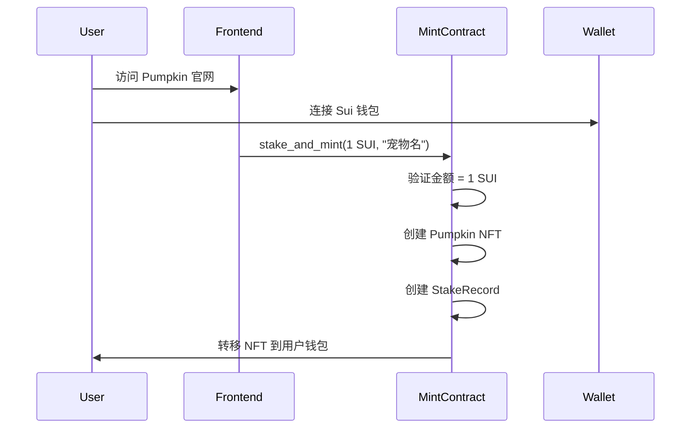
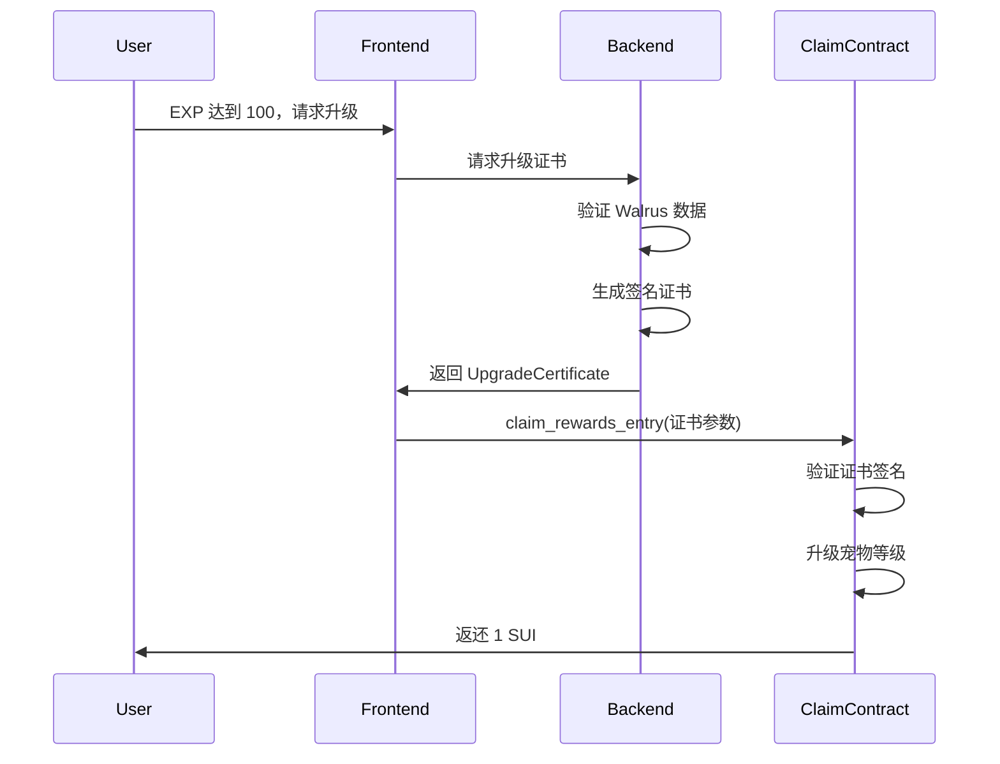
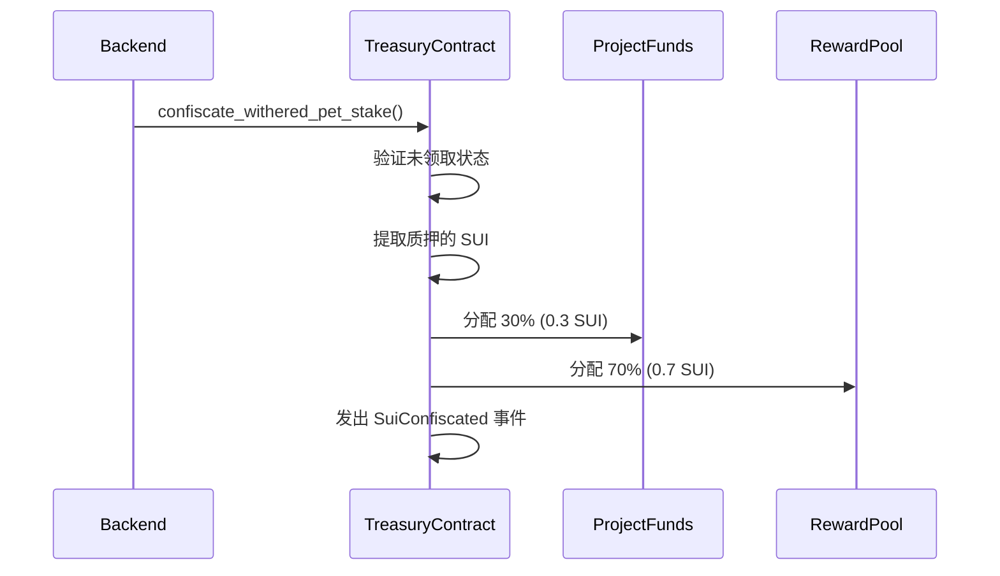

# Pumpkin 智能合约文档

## 项目概述

Pumpkin 是一个部署在 Sui 区块链上的 "Focus to Earn" 应用。用户通过质押 1 SUI 领养数字宠物 Pumpkin，通过专注学习获得经验值，升级后可取回质押的 SUI 并获得代币奖励。如果疏于照顾导致宠物凋零，质押的 SUI 将被没收并按比例分配。

## 合约架构

项目包含 4 个核心智能合约模块：

### 1. `pumpkin.move` - Pumpkin NFT 核心模块

#### 主要结构体

```move
public struct Pumpkin has key, store {
    id: UID,                    // 唯一标识符
    level: u64,                 // 当前等级（初始为1）
    name: String,               // 宠物名称
    image_url: String,          // 动态图片URL
    owner: address,             // 拥有者地址
}
```

#### 核心功能

- **`new_pumpkin()`**: 创建新的 Pumpkin NFT
- **`upgrade_level()`**: 升级宠物等级
- **`transfer_pumpkin()`**: 转移宠物所有权
- **访问器函数**: `level()`, `name()`, `owner()` 等

#### 事件

- `PumpkinCreated`: 宠物创建事件
- `PumpkinUpgraded`: 宠物升级事件

---

### 2. `mint.move` - 质押与铸造模块

#### 主要结构体

```move
public struct StakingVault has key {
    id: UID,
    balance: Balance<SUI>,      // 质押资金池
    total_staked: u64,          // 总质押金额
}

public struct StakeRecord has key, store {
    id: UID,
    owner: address,             // 质押者地址
    amount: u64,                // 质押金额（1 SUI = 1,000,000,000 MIST）
    pumpkin_id: address,        // 关联的 Pumpkin NFT ID
    is_claimed: bool,           // 是否已领取
}
```

#### 核心功能

- **`stake_and_mint()`**: 质押 1 SUI 并铸造 Pumpkin NFT
  ```move
  public entry fun stake_and_mint(
      payment: Coin<SUI>,           // 必须为 1 SUI
      pumpkin_name: vector<u8>,     // 宠物名称
      vault: &mut StakingVault,     // 质押金库
      ctx: &mut TxContext
  )
  ```

- **`extract_sui()`**: 从金库提取 SUI（仅限 claim 模块调用）
- **`mark_claimed()`**: 标记质押已领取

#### 质押要求

- **固定金额**: 必须质押exactly 1 SUI (1,000,000,000 MIST)
- **1:1 关系**: 每次质押对应一个 Pumpkin NFT
- **状态跟踪**: StakeRecord 跟踪所有质押信息

---

### 3. `claim.move` - 奖励领取模块

#### 主要结构体

```move
public struct VerifierCap has key {
    id: UID,
    public_key: vector<u8>,     // 后端验证者公钥
}

public struct UpgradeCertificate has drop {
    owner: address,             // 宠物拥有者
    pumpkin_id: address,        // NFT ID
    target_level: u64,          // 目标等级
    valid_until: u64,           // 证书有效期
    signature: vector<u8>,      // 后端签名
}
```

#### 核心功能

- **`claim_rewards()`**: 核心奖励领取函数
  ```move
  public fun claim_rewards(
      pumpkin: &mut Pumpkin,
      stake_record: &mut StakeRecord,
      vault: &mut StakingVault,
      certificate: UpgradeCertificate,
      verifier_cap: &VerifierCap,
      ctx: &mut TxContext
  )
  ```

- **`claim_rewards_entry()`**: 入口包装函数，便于前端调用

#### 验证流程

1. **时间验证**: 检查证书是否过期
2. **身份验证**: 验证调用者是否为宠物拥有者
3. **ID匹配**: 确认 Pumpkin ID 与证书一致
4. **状态检查**: 确保质押未被领取
5. **签名验证**: 验证后端服务签名
6. **执行升级**: 升级宠物等级并返还 SUI

#### 后端集成

后端服务需要生成包含以下数据的签名：
```
owner + pumpkin_id + target_level + valid_until
```

使用 ECDSA-K1 算法，对 Keccak256 哈希值签名。

---

### 4. `treasury.move` - 资金管理模块

#### 主要结构体

```move
public struct Treasury has key {
    id: UID,
    project_balance: Balance<SUI>,      // 项目资金（30%）
    reward_pool_balance: Balance<SUI>,  // 奖励池（70%）
    total_confiscated: u64,             // 总没收金额
    total_to_project: u64,              // 分配给项目总额
    total_to_reward_pool: u64,          // 分配给奖励池总额
}
```

#### 资金分配比例

- **70%**: 奖励池 - 用于支撑成功用户的代币奖励
- **30%**: 项目金库 - 用于项目开发、运营和生态建设

#### 核心功能

- **`confiscate_withered_pet_stake()`**: 没收凋零宠物的质押
- **`withdraw_project_funds()`**: 提取项目资金（仅管理员）
- **`use_reward_pool_funds()`**: 使用奖励池资金（仅管理员）

#### 没收流程

当宠物凋零时：
1. 标记质押记录为已领取（防止双重支出）
2. 从质押金库提取对应的 SUI
3. 按 70%/30% 比例分配到相应资金池
4. 更新统计数据
5. 发出 `SuiConfiscated` 事件

---

## 核心业务流程

### 1. 领养流程（Onboarding）



### 2. 升级与领取流程



### 3. 宠物凋零流程



---

## 安全特性

### 1. 权限控制
- **所有权验证**: 所有操作都验证调用者身份
- **管理员权限**: 资金提取仅限管理员
- **签名验证**: 升级操作需要后端服务签名

### 2. 防重放攻击
- **时间戳验证**: 证书包含有效期
- **状态检查**: 防止重复领取
- **唯一性**: 每个操作都有唯一标识

### 3. 资金安全
- **固定金额**: 质押金额固定为 1 SUI
- **余额验证**: 所有提取操作都检查余额
- **原子操作**: 所有资金操作都是原子性的

---

## 错误代码

### 通用错误
- `EInvalidStakeAmount = 0`: 质押金额无效
- `EInsufficientFunds = 1`: 余额不足
- `EUnauthorized = 2`: 未授权操作

### 升级相关错误
- `EInvalidSignature = 0`: 签名无效
- `ECertificateExpired = 1`: 证书已过期
- `EAlreadyClaimed = 4`: 已领取
- `EPumpkinMismatch = 6`: Pumpkin ID 不匹配

---

## 部署说明

### 环境要求
- Sui CLI
- Move 2024 Beta 版本
- 测试网络连接

### 部署步骤

1. **编译合约**
   ```bash
   sui move build
   ```

2. **部署到测试网**
   ```bash
   sui client publish --gas-budget 100000000
   ```

3. **初始化验证者**
   - 部署后获取 VerifierCap 对象 ID
   - 更新后端服务公钥

### 配置参数

| 参数 | 值 | 说明 |
|------|----|----|
| REQUIRED_STAKE_AMOUNT | 1,000,000,000 | 1 SUI in MIST |
| PROJECT_SHARE_BP | 3,000 | 30% (basis points) |
| REWARD_POOL_SHARE_BP | 7,000 | 70% (basis points) |

---

## 前端集成指南

### 1. 钱包连接
使用 `@mysten/dapp-kit` 连接 Sui 钱包

### 2. 质押与铸造
```typescript
const tx = new TransactionBlock();
tx.moveCall({
  target: `${PACKAGE_ID}::mint::stake_and_mint`,
  arguments: [
    tx.object(SUI_COIN_OBJECT_ID),  // 1 SUI coin
    tx.pure("我的小南瓜"),            // 宠物名称
    tx.object(STAKING_VAULT_ID),    // 质押金库
  ],
});
```

### 3. 领取奖励
```typescript
const tx = new TransactionBlock();
tx.moveCall({
  target: `${PACKAGE_ID}::claim::claim_rewards_entry`,
  arguments: [
    tx.object(PUMPKIN_NFT_ID),      // Pumpkin NFT
    tx.object(STAKE_RECORD_ID),     // 质押记录
    tx.object(STAKING_VAULT_ID),    // 质押金库
    tx.pure(certificate.owner),     // 证书参数
    tx.pure(certificate.pumpkin_id),
    tx.pure(certificate.target_level),
    tx.pure(certificate.valid_until),
    tx.pure(certificate.signature),
    tx.object(VERIFIER_CAP_ID),     // 验证者权限
  ],
});
```

---

## 后端集成指南

### 证书生成示例 (Node.js)

```javascript
const { ethers } = require('ethers');

class CertificateGenerator {
  constructor(privateKey) {
    this.wallet = new ethers.Wallet(privateKey);
  }

  async generateUpgradeCertificate(owner, pumpkinId, targetLevel, validUntil) {
    // 构造待签名消息
    const message = ethers.utils.concat([
      ethers.utils.arrayify(owner),
      ethers.utils.arrayify(pumpkinId),
      ethers.utils.solidityPack(['uint64'], [targetLevel]),
      ethers.utils.solidityPack(['uint64'], [validUntil])
    ]);

    // 计算 Keccak256 哈希
    const messageHash = ethers.utils.keccak256(message);
    
    // 签名
    const signature = await this.wallet.signMessage(ethers.utils.arrayify(messageHash));
    
    return {
      owner,
      pumpkin_id: pumpkinId,
      target_level: targetLevel,
      valid_until: validUntil,
      signature: ethers.utils.arrayify(signature)
    };
  }
}
```

---

## 监控与运维

### 关键事件监听

1. **StakeAndMint**: 监控新用户质押
2. **RewardsClaimed**: 监控成功升级
3. **SuiConfiscated**: 监控宠物凋零
4. **PumpkinUpgraded**: 监控等级变化

### 关键指标

- 总质押金额 (`vault_total_staked`)
- 项目资金余额 (`get_project_balance`)
- 奖励池余额 (`get_reward_pool_balance`)
- 总没收金额 (`get_total_confiscated`)

---

## 联系信息

如有技术问题或需要支持，请联系开发团队：
- 项目仓库: [GitHub Repository]
- 技术文档: [Tech Docs]
- 社区讨论: [Discord/Telegram]

---

*最后更新: 2025年8月19日*
*合约版本: v1.0*
*Sui Network: Testnet*